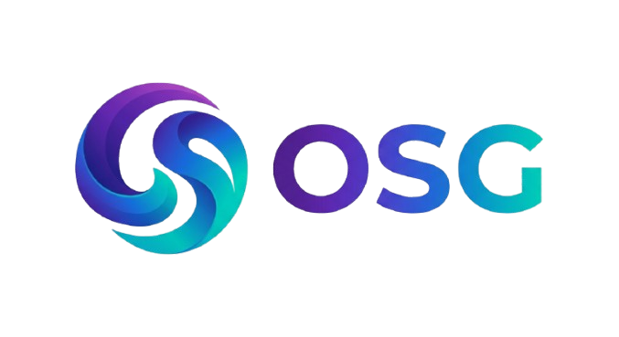

<!-- Project Logo -->
<p align="center">
  
</p>

<!-- Badges -->
<p align="center">
  <a href="#">
    
  </a>

  <a href="#">
    
  </a>

  

  
</p>

---

# <p align="center">OSG</p>

<p align="center">
A sandbox-style development system for building, testing, and experimenting with custom tools and environments.
</p>

---

## ⚙️ Features
- Modular sandbox system
- Fully customizable environment
- Lightweight architecture
- Developer-focused tools
- Expandable system design
- Experimental runtime support

---

## 🖼️ Screenshots
<p align="center">
  
</p>

---

## 🚀 Getting Started

### Run the project
```bash
open index.html
